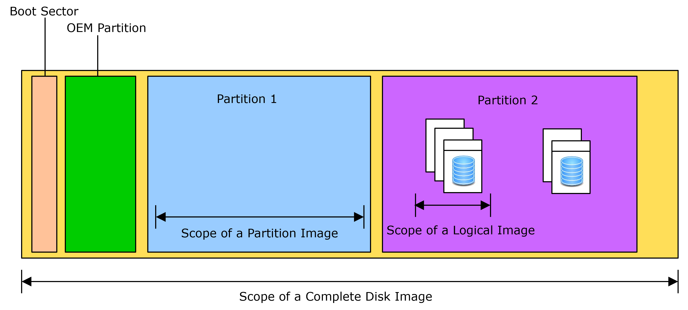

# Digital Evidence

## What is Digital Evidence?

- Digital evidence may be found in storage devices such as:
  - Hard Disk Drive (HDD)
  - Random Access Memory (RAM)
  - Mobile Phones
  - Network or External Storage Devices

- Digital evidence is fragile and can be altered, damaged, or destroyed by improper handling or examination
- Failure to preserve the evidence may render it unusable or lead to an inaccurate conclusion which loses its credibility
- Extremely important that the original evidence is acquired in a manner that protects and preserves the evidence
- Any probative information stored or transmitted in digital form that a party to a court case may use at trial is considered as a digital evidence
- Examples:
  - Emails
  - Digital Photographs
  - Word processing documents
  - Instant message histories
  - Internet browsing histories
  - Content of Memory(RAM)
  - Video and Audio files

## Categories of Forensic Data

- Computer forensics focuses on 3 categories of data:
  - Active Data
    - Data that can be seen
      - Example: Files, programs, data used by OS
  - Latent Data
    - Data that exists despite being deleted
      - Example: Data that was partially overwritten or stored in slack space
      - For recovering such data, specialised tool is required
  - Archival Data
    - Data in backup
      - Can be stored offshore in tapes, flash drives, HDDs, SSDs, etc.

## Persistent vs Volatile Data

- A significant amount of data is gathered, preserved, and analysed
- 2 basic types of data are collected
  - Persistent
    - Data that is stored on a local hard drive (or another medium)
    - Data is preserved when the computer is turned off
  - Volatile
    - Data that is stored in memory, or exists in transit, that will be lost when the computer loses power or is turned off.
    - Volatile data resides in registries, cache, and random access memory (RAM)

## Forensic Image

- Forensic image of an affected or suspect computer system is one of the most comprehensive sources of information
- Forensic image is a copy of original evidence generally collected by a tool that performs bit-level copying from one location to another
- 3 common disk image formats
  - Expert Witness/EnCase (E01)
  - Raw (DD)
  - Virtual machine disk files (VMDK, OVF, VDI, VHD, etc.)
- Images could include:
  - Physical or logical copy of a hard drive (logical or physical)
  - Memory dump
  - Copies of removable media
  
## Forensic Image Format

- FI should create 2 bit stream copies of evidence
- 3 types of images:
  - Complete disk
    - Most preferred method as it is the most comprehensive
  - Partition
    - Contains all allocation units from an individual partition on a drive
    - Includes unallocated space and file slacks within the partition
    - Does not capture all data on a drive (as other partitions are not captured)
    - Only used in certain circumstances.
      - Example: Excessively large disk
  - Logical
    - Only certain files are acquired

## Drive Layout Example

## Traditional Imaging Process

- Traditional imaging is performed on static drives (hard drives)
- Computer system has been turned off and booted to a forensic imaging environment, or the disk has been plugged into an imager or examination workstation for duplication
- Specialised hardware is used to prevent source media from being modified
  - Hardware Write Blockers
    - Hardware write blocker is a device that sits in the connection between a computer and a storage unit
    - Monitors the commands that are being issued and prevent computer from writing data to the storage device
    - Comes with many interfaces, such as ATA, SCSI, Firewire, USB, SATA, etc.

## Image Creation Tools

- Commercial Software Tool:
  - Guidance Software - EnCase
  - AccessData FTK Imager
- Open Source Tool (Unix/Linux)
  - DC3dd
  - DCFLdd
  - dd

## EnCase Evidence File (E01)

- EnCase evidence file is often called the image file
  - Has the naming convention of '.Exx'.
    - Example: fraud.E01
- Contains the bit-stream image of the suspect drive, CRC verification, case identification info (header) and an MD5 hash
- Head information as entered by the examiner become part of the evidence file and cannot be changed

## Physical Layout of EnCase Evidence File

- Evidence file contains 3 basic parts:
  - Header
  - Data blocks
    - Bit by bit copy of the data blocks on the suspect media
  - Checksum and Hash
    - 32-bits verification (CRC - Cyclical Redundancy Check)
    - MD5 hash for checking for integrity

## EnCase Evidence File Format

- EnCase computes a CRC for every block of 64 sectors of data (32 Kbytes)
  - 1 sector = 512 bytes
- 128-bit MD5 hash is computed for the entire data block section (exclude the CRCs)
  - MD5 hash verifies that both the imaged media and the evidence file contain the exact data
- When an '.Exx' evidence file is added to a case, EnCase automatically verifies the CRC and re-computes has value for the evidence data within the '.Exx' file
- Verification process can only be successfully completed after both the MD5 acquisition and verification hash values match and no CRC errors are reported

## Challenges faced in Computer Evidence

- Growth in electronic devices and different platform
  - Example: Smartphones, tablets, ipod, GPS devices, etc.
- Growth in storage size
  - Example: Time taken to search a 1 TB hard drive
- Location/Storage to store huge evidence files
- Challenges surrounding authenticity and integrity of evidence
  - Was the data altered?
  - Was the program that generated the data reliable?
- Ensuring integrity of evidence, special hardware and software tools are used in digital forensic investigations
