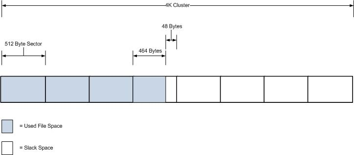

# Evidence Extraction & Analysis

!!! warning "Work in Progress"
    Site still Work In Progress. Expect A Major Overhaul Soon.

## Slack Space

!!! important

    * RAM slack

- Unused space between the end of the actual file and the end of the defined data unit (cluster)
- When file is written, and does not occupy the entire cluster, the remaining space is slack space
- Example:
  - Assume that the OS uses a 4k cluster and 512 byte sector. This means that if a 2000 byte file were written to this cluster the remaining 2096 bytes would be slack

## Hard Disk Drive (Optional)
- Main Storage Media for most computer systems
- Holds:
  - Boot files
  - Operating System files
  - Programs files
  - Data files

### What does a Hard Disk Drive contains? (Optional)
- Tracks
  - Thin concentric circular strips on a disk or platter surface which comprise the magnetic medium to which data is written by the drive heads
- Cylinder
  - Consists of the same track number on each platter, spanning all such tracks across each platter surface that is able to store data
- Data is written to and read from the surface of a platter by device called a head
- Tracks are divided into sectors
  - Sector is the smallest physical storage unit on a disk 512 bytes in size
