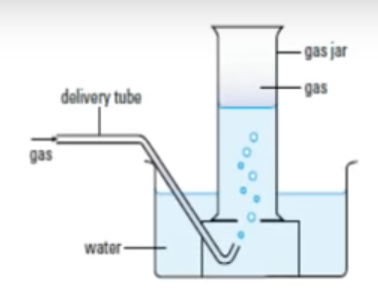
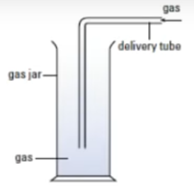
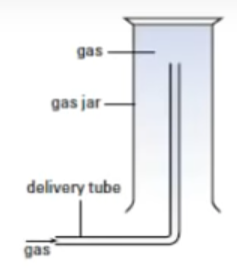
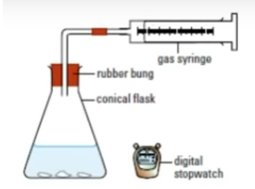
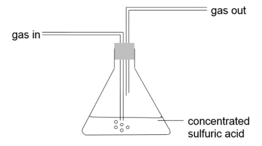
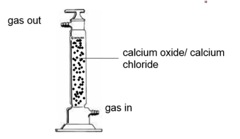
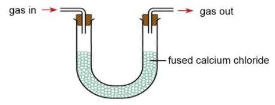

# Experimental Techniques and Measurements

| Mass                    | Volume                        | Time                  | Temperature       |
|-------------------------|-------------------------------|-----------------------|-------------------|
| Kg                      | $cm^3$ or $dm^3$              | Hours/minutes/seconds | Celsius or Kelvin |
| Beam/electronic balance | Measuring cylinder or burette | Stopwatch             | Thermometer       | 

## Measuring apparatus

### Electronic balance

Accuracy: 2 d.p.

!!! tip

    **Why is there a mini glass enclosure around the balance?**

    To prevent wind from affecting measurement

### Measuring cylinder

For approximate measurements

$1cm^3 \textrm{ to } 1000cm^3 \textrm{ or more }$

### Burette

For accurate measurements to $0.05cm^3$

### Pipette

* Very accurate
* Measure fixed volumes

### Volumetric flask

* Very accurate
* Measure fixed volumes
* Used to prepare standard solutions of exact concentration

### Syringe

* (small syringe) small volume of **liquids**
* (large syringe) large volume of **gasses**

!!! warning

    Read at bottom of meniscus

## Common questions

### Why do we need to collect gasses?

Allow us to determine the rate and progress of a reaction

### Why do we need to add distilled water/filter?

To separate soluble and insoluble compounds

## Methods of collecting gasses

Considerations to be made

* Density (compared to air)
* Solubility (in water)

### Displacement of water

For gasses which are insoluble in water

* $H_2, O_2, CO_2$

<figure markdown>
  
  <figcaption>Displacement of water</figcaption>
</figure>

### Downward delivery

For gasses which are denser than air (and soluble in water)

* $CI_2$

<figure markdown>
  
  <figcaption>Downward delivery</figcaption>
</figure>

### Upward delivery

For gasses which are less dense than air (and soluble in water)

* $NH_3, H_2$

<figure markdown>
  
  <figcaption>Upward delivery</figcaption>
</figure>

### Using a gas syringe

When there is a need to monitor the rate of evolution of a gas

<figure markdown>
  
  <figcaption>Gas syringe</figcaption>
</figure>

## Methods of collecting dry gasses

### Acidic

Concentrated sulfuric acid

* $H_2SO_4$

<figure markdown>
  
  <figcaption>Acidic</figcaption>
</figure>

### Alkaline

Calcium Oxide

<figure markdown>
  
  <figcaption>Alkaline</figcaption>
</figure>

### Neutral

Fused Calcium Chloride

<figure markdown>
  
  <figcaption>Fused calcium chloride</figcaption>
</figure>

## Properties of common gasses

| Gas               | Formula | Color           | Density (compared to air) | Solubility in water |
|-------------------|---------|-----------------|---------------------------|---------------------|
| Ammonia           | $NH_3$  | Colorless       | Less dense                | Extremely soluble   |
| Carbon Dioxide    | $CO_2$  | Colorless       | Denser                    | Slightly soluble    |
| Chlorine          | $CI_2$  | Greenish-Yellow | Denser                    | Soluble             |
| Hydrogen          | $H_2$   | Colorless       | Less dense                | Insoluble           |
| Hydrogen Chloride | $HCI$   | Colorless       | Denser                    | Very soluble        | 
| Oxygen            | $O_2$   | Colorless       | Slightly denser           | Slightly soluble    |
| Carbon Monoxide   | $CO$    | Colorless       | Slightly denser           | Slightly soluble    |
| Nitrogen          | $N_2$   | Colorless       | Slightly denser           | Insoluble           | 
| Sulphur dioxide   | $SO_2$  | Brownish        | Denser                    | Very soluble        |
| Helium            | $He$    | Colorless       | Less dense                | Insoluble           |

## Testing for ammonia gas

Usually white fumes can be seen

**Procedure:**

1. Heat the test tube
2. Move test tube away from the flame
3. Place damp litmus paper over mouth of test tube

## Boiling tubes

* To collect filtrate
* For strong heating of solutes
  * Thermal decomposition

## Identify colors of compounds

* Solid
  * Shiny
    * Metal
      * Gray
        * Group I
      * Colored
        * Transition metals
  * Powder
    * Non metallic elements
      * $NaCl$
    * Compound
      * White
        * Group I/II/???
          * ${CO_3}^{2-}$
          * ${NO_3}^-$
          * ${SO_4}^{2-}$
        * Oxides/hydroxide
      * Colored
* Solution
  * Colored
  * Colorless

???+ tip "Details"

    * Calcium bicarbonate is soluble in lime water
    * Displacement reactions are exothermic
